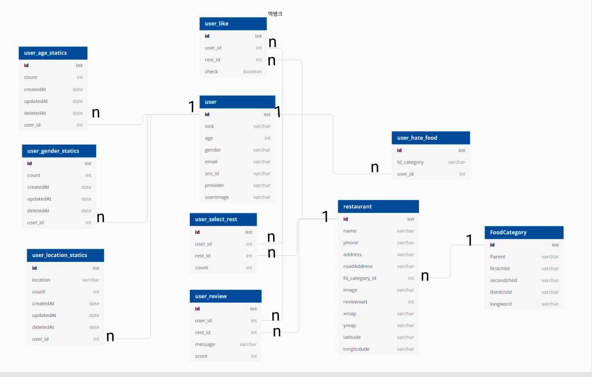

# Mukbank-server-renewal Server

## Prerequisite

- Linux
- node.js 10.x or higher
- npm package manager
- mysql 
  
## Getting Started

### Prepare a config file

npm install 로 모듈을 설치할 수 있습니다.<br>
Make a config file .env for connecting database .

```js
DB_PROD_USERNAME=
DB_PROD_PASSWORD=
DB_PROD_DATABASE=
DB_PROD_HOST=
DB_PROD_VENDER=

JWT_KEY=

GOOGLE_ID=
GOOGLE_SECRET=

KAKAO_ID=

FACEBOOK_ID=
FACEBOOK_SECRET=
```

## ERD 데이터베이스 설계



